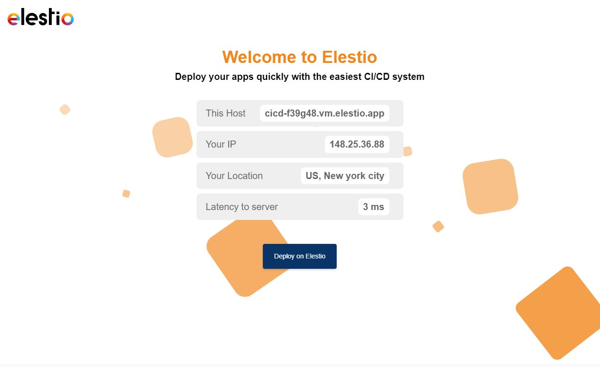

# Flask on Elestio

This is a minimal example of a Flask.

Click on the button below to deploy this repository with CI/CD on Elestio:

<a href="https://dash.elest.io/deploy?source=cicd&social=Github&url=https://github.com/elestio-examples/flask"></a>



## Documentation: https://flask.palletsprojects.com/

<br/>
<br/>

# Steps to clone this repository and run locally

### Step 1: Clone this repository

```
git clone YOUR_REPOSITORY_URL
```

### Step 2: Make some changes and push

Try to make some change in your Flask project then push to the git repository

After few seconds to few minutes your change will be deployed on your CI/CD target 🚀
